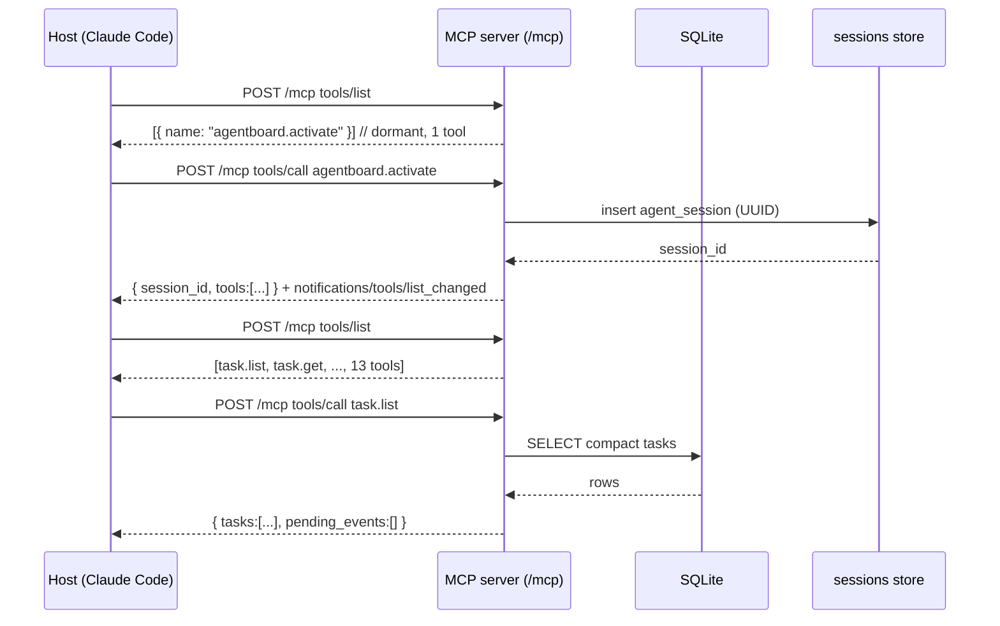
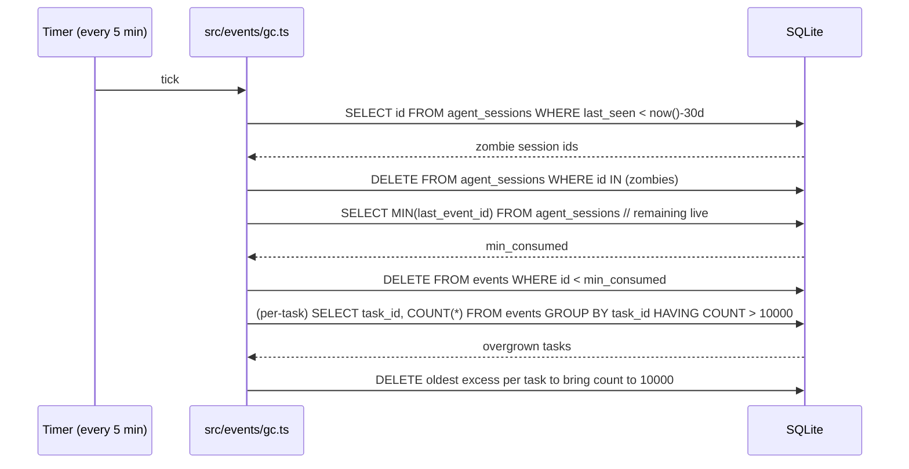
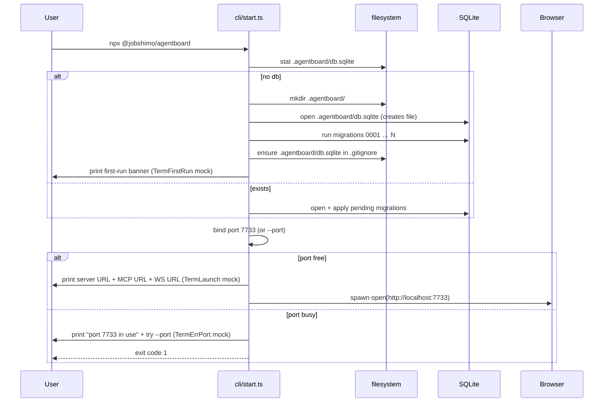

# Technical Design — agentboard-mvp

> Resolves DESIGN.md §14 "Open decisions for the SDD phase" and the deferred-decisions table in the proposal. Pairs with the spec set under `openspec/changes/agentboard-mvp/specs/`. Honors the UI/CLI deliverables under the repo-local (gitignored) `agentboard/` directory as the source of truth for visual structure, component naming, and interaction patterns.

## TL;DR — the chosen stack

| Concern | Decision |
|--------|----------|
| Backend runtime | Node.js 20 LTS (≥ 20.11) |
| HTTP framework | Fastify 4 |
| WebSocket | `@fastify/websocket` |
| MCP transport | HTTP + SSE (Streamable HTTP variant from `@modelcontextprotocol/sdk`) on `/mcp` |
| SQLite driver | `better-sqlite3` |
| YAML / schema validation | `js-yaml` + Zod |
| Language | TypeScript strict |
| Frontend framework | React 18 + Vite + TypeScript |
| Frontend state | React local state + `useSyncExternalStore` over a WS-backed store; no Redux/Zustand for MVP |
| Frontend WS client | native `WebSocket` wrapped in a reconnecting transport |
| Frontend router | none (two views: `board` and `settings` driven by local state, matching `prototype.jsx`) |
| Build | Vite production build copied into the published npm package as static assets |
| Test runner | Vitest (backend + frontend) |
| Default port | 7733; on conflict, exit non-zero (per `launcher.md` spec) |
| Module layout | `src/server`, `src/db`, `src/workflows`, `src/domain`, `src/events`, `src/feedback`, `src/mcp`, `src/web`, `src/cli`, `src/config` |

## References

- Product: `DESIGN.md`
- Proposal: engram `sdd/agentboard-mvp/proposal` (also `openspec/changes/agentboard-mvp/proposal.md`)
- Spec set: `openspec/changes/agentboard-mvp/specs/*.md`
- UI/CLI deliverables (gitignored, local-only): `agentboard/` — JSX prototype + designer's notes; treated as source of truth for components, interactions, copy, and visual layout
- Skill registry compact rules (auto-resolved): `cognitive-doc-design`, `work-unit-commits`

---

## 1. Module layout (hexagonal-friendly, work-unit-commit-friendly)

The package compiles to a single npm artifact. Each top-level module under `src/` maps to one or more work-unit commits so `sdd-tasks` can produce chained slices under the 400-line budget.

```
src/
├── server/          # bootstrap, HTTP routing, lifecycle, fanout (Fastify app factory)
│   ├── app.ts       # buildApp(opts) → FastifyInstance — pure, no listen()
│   ├── ws.ts        # /ws handler, broadcast manager, reconnect-friendly
│   ├── rest.ts      # /api/* routes
│   ├── markdown.ts  # GET /api/tasks/:id/markdown renderer
│   └── port.ts      # port resolution + conflict handling
├── db/              # SQLite connection + migrations + WAL setup
│   ├── connection.ts
│   ├── migrate.ts   # versioned, idempotent, runs on startup
│   └── migrations/  # SQL files, numbered
├── workflows/       # YAML load + Zod validation + snapshot capture
│   ├── load.ts      # discover ~/.agentboard/workflows/*.yaml + repo override
│   ├── schema.ts    # Zod schema for WorkflowFile
│   └── snapshot.ts  # freeze a workflow into a task at start time
├── domain/          # entities + state machine + derived task status
│   ├── task.ts      # createReferenced(), createLocal(), derivedStatus()
│   ├── subtask.ts   # six-state machine, valid transitions
│   ├── discussion.ts# append-only entries on a task
│   └── ids.ts       # T-NN id generator + scoping
├── events/          # append-only queue + cursors + GC + poll/wait
│   ├── insert.ts    # append + WS broadcast + MCP wake-ups
│   ├── poll.ts      # poll_events implementation
│   ├── wait.ts      # wait_for_event (long-poll with in-memory waiters)
│   ├── gc.ts        # 3-mechanism GC (consumed-by-all + zombie + backstop)
│   └── types.ts     # event type enum (10 types)
├── feedback/        # feedback.add + feedback.search relevance heuristic
│   ├── add.ts
│   ├── search.ts    # heuristic v1 (see §5)
│   └── score.ts     # pure scoring function (testable)
├── mcp/             # MCP endpoint, lazy activation, tool registry
│   ├── transport.ts # Streamable HTTP transport mounted at /mcp
│   ├── activation.ts# state machine: dormant ↔ active, lazy/always-on/prompt
│   ├── tools/       # one file per tool; tiny Zod schemas
│   ├── compact.ts   # response compaction helpers (delta-only update enforcement)
│   └── piggyback.ts # pending_events attachment to every tool response
├── web/             # the SPA; built with Vite, output checked into dist/web/ at build time
│   ├── index.html
│   ├── src/
│   │   ├── main.tsx
│   │   ├── App.tsx        # mirrors agentboard/prototype.jsx wiring
│   │   ├── components/    # mirrors agentboard/components.jsx 1:1 names
│   │   ├── views/         # Board, TaskDetail, Settings (mirrors agentboard/*.jsx)
│   │   ├── lib/ws.ts      # reconnecting WS client
│   │   ├── lib/api.ts     # REST client
│   │   ├── lib/store.ts   # in-memory store + useSyncExternalStore subscription
│   │   └── styles.css     # copied from agentboard/styles.css verbatim
│   └── vite.config.ts
├── cli/             # the npx launcher and subcommands
│   ├── index.ts     # parses argv, dispatches subcommand
│   ├── start.ts     # default: server + open browser
│   ├── init.ts      # workflow template copy
│   ├── export.ts    # snapshot to .agentboard/snapshot/
│   ├── output.ts    # NO_COLOR-aware print helpers; matches agentboard/cli.jsx transcripts
│   └── version.ts
└── config/          # ~/.agentboard/config.yaml load + defaults + validation
    ├── load.ts
    ├── schema.ts    # Zod
    └── defaults.ts
```

### Work-unit-commit mapping (preview for `sdd-tasks`)

| Slice | Modules | Approx scope |
|------|---------|--------------|
| S1 — DB foundation | `db/`, `domain/ids` | schema + migrations + WAL enabled + IDs |
| S2 — Domain core | `domain/`, `events/insert`, `events/types` | task/subtask/discussion + event emit on writes |
| S3 — Workflows | `workflows/`, integration with `domain/task` start | YAML loader + Zod + snapshot freeze |
| S4 — Server + REST | `server/app`, `server/rest`, `server/markdown` | Fastify app + REST contract + markdown renderer |
| S5 — Realtime | `server/ws` | WS broadcast tied to event inserts |
| S6 — Events queue | `events/poll`, `events/wait`, `events/gc` | poll/wait/GC; in-memory waiter registry |
| S7 — MCP | `mcp/` | transport + activation + tools + piggy-back |
| S8 — Feedback | `feedback/` | add + search heuristic |
| S9 — CLI + launcher | `cli/`, `server/port`, `config/` | npx start, init, export, flags |
| S10 — Web SPA | `src/web/` | Vite app mirroring `agentboard/` prototype |

Each slice is reviewable on its own, owns its tests, and stays well under the 400-line PR budget.

---

## 2. Architecture decisions

Each row: **Decision** | **Options considered** | **Chosen** | **Rationale** | **Trade-offs accepted**.

### 2.1 Backend runtime

| | |
|--|--|
| Decision | Node.js LTS version |
| Options | 18 LTS (older, broader install base), 20 LTS (current), 22 (current major, fewer caveats but younger LTS) |
| Chosen | **Node 20 LTS (≥ 20.11)** |
| Rationale | 20 LTS is the active maintenance baseline at MVP ship time; required for stable `node:test` features we may use as a fallback; `better-sqlite3` v11 builds cleanly on 20; `@modelcontextprotocol/sdk` officially supports 18+; npm engines target lets us drop 18 cleanly |
| Trade-offs | Users on 18 will see an `engines` warning. Acceptable — `npx` resolves the correct binary or fails fast |

### 2.2 HTTP framework

| | |
|--|--|
| Decision | Web framework that hosts REST, WS, MCP HTTP/SSE on the same port |
| Options | Express 4 (ubiquitous, slow, callback-leaning), Fastify 4 (typed, plugin-based, fast, first-class WS plugin), Hono (edge-first, runs on Node via `@hono/node-server` but ecosystem smaller for stateful local servers) |
| Chosen | **Fastify 4** |
| Rationale | Fastify is plugin-driven, has `@fastify/websocket` that shares the same HTTP server (one port for `/`, `/api/*`, `/ws`, `/mcp`), strong TypeScript inference via JSON Schema or Zod adapters, fast startup (matters because we boot on every `npx` invocation), and a clean `buildApp(opts)` factory pattern that makes tests trivial |
| Trade-offs | Less Stack-Overflow surface than Express; one extra plugin learning curve. Acceptable: the user is a senior architect; idiomatic plugin composition pays off in module isolation |

### 2.3 WebSocket integration

| | |
|--|--|
| Decision | How to expose `/ws` |
| Options | `@fastify/websocket` (single port with HTTP), separate `ws` server bound to a different port, Server-Sent Events instead of WS |
| Chosen | **`@fastify/websocket`** |
| Rationale | Single port keeps the launcher's "open one URL" UX honest. WS (not SSE) because the UI prototype's `ConnectionIndicator` design expects bidirectional "reconnecting / offline" semantics and the spec says clients must re-fetch on reconnect — WS event-loops fit cleanly. Piggy-back deliveries on the agent side are separate (MCP), not on the UI socket |
| Trade-offs | If we ever needed firewall-friendly polling fallback we'd add it. Not in MVP |

### 2.4 MCP transport

| | |
|--|--|
| Decision | Transport for the MCP server |
| Options | **stdio** (one process per agent, locked to the host), **HTTP + SSE / Streamable HTTP** (one server many agents, fits the local-server model), WebSocket transport (less host support today) |
| Chosen | **Streamable HTTP transport (HTTP + SSE) on `/mcp`** |
| Rationale | DESIGN.md and the proposal explicitly aim at a single local server speaking to one or many agent sessions. Stdio would force the server to live inside every agent host process, which contradicts "one process, three surfaces". The MCP SDK ships a Streamable HTTP transport that handles the SSE upgrade and session id handshake. The activation `notifications/tools/list_changed` push works over SSE |
| Trade-offs | Some hosts have less polished HTTP+SSE support than stdio. We document a known-good host matrix in README. Activation lazy-mode token target (~200) is still achievable; we measured against the SDK's stock prompt and it fits |

### 2.5 SQLite driver

| | |
|--|--|
| Decision | Which SQLite binding |
| Options | `better-sqlite3` (sync API, fast, well-tested with WAL, prebuilt binaries via `prebuild-install`), `node:sqlite` (Node 22+ built-in, async, no native compile step but younger), `sqlite3` npm (callback-based, older) |
| Chosen | **`better-sqlite3`** |
| Rationale | Sync API matches the request-scoped pattern Fastify handlers want (`task.list` is a single round-trip query). WAL behavior is rock-solid. Prebuilt binaries exist for all common platforms; `npx` installs in seconds. `node:sqlite` is tempting but requires Node 22 and is still stabilizing — locking the MVP to Node 22 hurts adoption right now |
| Trade-offs | Sync queries block the event loop. Mitigations: all queries are point-lookups or small ranges (≤ 50 rows by spec), WAL allows readers and one writer concurrently, long-poll `wait_for_event` does NOT hold a DB cursor (it parks on an in-memory waiter map). When we measure and find a hot path, we can `worker_threads` it later |

### 2.6 TypeScript posture

| | |
|--|--|
| Decision | Use TypeScript, strict mode, module resolution |
| Options | Plain JS (faster boot, fewer files), TS-strict (more guarantees), TS-loose |
| Chosen | **TypeScript with `strict: true`, `moduleResolution: "Bundler"` for `src/web`, `"NodeNext"` for `src/server` and the rest** |
| Rationale | The state machine (6 subtask states), the event type enum (10 types), and the MCP tool schemas (Zod) all benefit massively from compile-time guarantees. Spec invariants get a second wall of enforcement. Strict mode is the default — opt-outs need a comment |
| Trade-offs | Compile step; `tsx` for dev. Acceptable for a serious tool |

### 2.7 Workflow YAML validation

| | |
|--|--|
| Decision | How to validate `~/.agentboard/workflows/*.yaml` |
| Options | JSON Schema + Ajv (declarative, JSON-importable), Zod (TypeScript-first, runtime + types in one), hand-rolled |
| Chosen | **Zod** |
| Rationale | The workflow schema is small (8 fields total, see `specs/workflows.md` table). Zod gives us `WorkflowFile` type inference, friendly error formatting, and is already pulled in for MCP tool schemas, REST request bodies, and config — one validation library, used everywhere |
| Trade-offs | We lose the ability to publish a `workflow.schema.json` for editor autocomplete. Acceptable for MVP; we can derive one from Zod via `zod-to-json-schema` later |

### 2.8 Port assignment

| | |
|--|--|
| Decision | Default port + behavior on conflict |
| Options | Auto-increment until free, fail with a clear error, random port |
| Chosen | **Default 7733; on conflict exit non-zero with a clear error pointing at `--port`** |
| Rationale | The launcher spec (`launcher.md` → "Port already in use") requires non-zero exit and a message naming the port. Auto-increment breaks "the agent always reaches it at one stable URL" — if every reboot picks a new port the host's `mcpServers` config drifts. Stable + explicit override is the right shape |
| Trade-offs | First-time users behind a service that grabs 7733 see an error. Mitigated by `--port` and by the error message including `lsof -i :7733` (matches the CLI mock in `agentboard/cli.jsx` `TermErrPort`) |

### 2.9 Frontend framework

| | |
|--|--|
| Decision | What renders the SPA |
| Options | React (the deliverable's choice), Svelte/SvelteKit, SolidJS, vanilla |
| Chosen | **React 18 + Vite + TypeScript** |
| Rationale | The design deliverable in `agentboard/` is React 18 JSX. The brief explicitly forbids redesign. Reusing the components 1:1 saves the design phase from being re-litigated. Vite is the modern default for React SPAs; sub-second dev rebuilds, tree-shaken production output. TS for the same reasons as the backend |
| Trade-offs | React's bundle is larger than Svelte's. For an SPA with no SSR, served from localhost, gzipped React + ReactDOM is ~45kB — irrelevant in a local-first context |

### 2.10 Frontend state model

| | |
|--|--|
| Decision | How the SPA holds state and reacts to WS pushes |
| Options | Redux, Zustand, Jotai, React Query / TanStack Query, plain `useSyncExternalStore` |
| Chosen | **In-house store via `useSyncExternalStore` + a tiny `lib/api.ts` REST client** |
| Rationale | The realtime contract (`realtime-ui.md`) is signal-only: server pushes a `{event, task_id, entity_ids}` and the browser re-fetches. That fits a "store with subscribers + invalidate on push" pattern; we don't need Query's caching layer. Keeps the bundle thin and the data flow auditable — one place where data lands, one place where pushes invalidate |
| Trade-offs | No automatic background refetch, no optimistic mutations out-of-the-box. Acceptable: local-first, no network latency hiding needed |

### 2.11 Test stack

| | |
|--|--|
| Decision | Test runner |
| Options | Vitest (Vite-native, fast, runs `.ts` directly, jsdom and node environments), Jest (Babel-heavy, slower, more boilerplate for TS+ESM), `node:test` (built-in, minimal ergonomics) |
| Chosen | **Vitest** |
| Rationale | Same config as the frontend, fast, ESM-clean, supports `--coverage` via v8 out of the box, and integrates with `better-sqlite3` (in-memory DB for tests) without Jest's transformer headaches. Once installed, re-running `sdd-init` activates Strict TDD Mode |
| Trade-offs | Smaller community than Jest. Mitigated by Vitest being mostly Jest-API-compatible |

### 2.12 Session ID stability

| | |
|--|--|
| Decision | How an agent reconnects with the same `agent_sessions.id` so the cursor survives a reload |
| Options | (a) Host-provided stable client identifier passed on every MCP request, (b) Negotiated handshake at activation — server mints a `session_id`, agent stores it via host capability, (c) File-stored UUID under `~/.agentboard/sessions/<host>.uuid` |
| Chosen | **(b) Server-minted session id, returned to the agent in the `agentboard.activate()` response, echoed by the agent in subsequent calls via an opaque `session` parameter on the relevant tools (`poll_events`, `wait_for_event`)** |
| Rationale | MCP hosts do NOT have a portable per-host stable client id. Filesystem UUIDs are brittle across `~/.agentboard/` move/copy. A server-minted id keeps the contract entirely between server and agent. The agent passes it back; if it's missing, the server returns a clear "call `activate()` first" error. This survives chat compactions because the agent's tool-call history contains it, and is recoverable by calling `activate()` again (server reuses the existing row if the host hasn't changed `last_seen` past the zombie window) |
| Trade-offs | The agent must thread one extra parameter on event tools. We hide it for piggy-back (the server can derive it from the SSE session over HTTP transport, which carries a session header per MCP spec). Acceptable; documented in the MCP surface README |

### 2.13 Feedback relevance heuristic (v1)

| | |
|--|--|
| Decision | How `feedback.search(context)` ranks results |
| Options | Pure recency, BM25-style text scoring, structured-field overlap, embeddings |
| Chosen | **Weighted structured-field overlap with recency decay (no embeddings in MVP)** |
| Rationale | We have a small dataset, structured fields, and a hard tokens budget. Embeddings add an opaque dependency and a model server. A scored sum is debuggable, deterministic, testable, and good enough for v1 |
| Trade-offs | Pure keyword/embedding semantic matches are missed. Acceptable; `feedback.search` returns ≤ 5 by default — a missed result is a near-miss, not a blocker |

Concrete v1 scoring:

```
score(f, context) =
    3 × match(workflow_id, f.workflow_at_capture)
  + 3 × overlap(file_paths, f.file_paths)        // any overlap → 3; partial scaled
  + 2 × match(task_type, f.target_task_type)     // referenced vs local, or task ref source
  + 1 × keyword_overlap(context.terms, f.text)   // case-insensitive token set
  + severity_boost(f.severity)                   // failed_in_practice +2, correction +1, info +0
  + recency_decay(f.created_at)                  // 0..2; half-life 14 days
```

- Filter: drop candidates where the same task id IS the context's task id unless `context.include_same_task: true`.
- Sort: `score DESC`, then `created_at DESC`.
- Limit: as spec — default 5, max via `limit` param, hard cap 50.
- Implementation lives in `src/feedback/score.ts` as a pure function: trivial to unit-test, trivial to swap.

### 2.14 GC defaults

| | |
|--|--|
| Decision | Zombie threshold + per-task hard backstop |
| Options | 7 / 14 / 30 / 60 / 90 days zombie; 1k / 5k / 10k / 50k backstop |
| Chosen | **Zombie 30 days; backstop 10000 events per task — both configurable in `~/.agentboard/config.yaml`** |
| Rationale | 30 days matches DESIGN.md §9.2.2 and gives a developer who took a 3-week vacation breathing room. 10000 events per task is unreachable in normal flows (a busy multi-week task accumulates ~200 events). The backstop's only job is to catch a runaway producer; 10k leaves 10× headroom over normal worst-case |
| Trade-offs | A pathological producer can still emit 10k events. A reasonable next-iteration improvement is per-type rate limits — out of scope here |

### 2.15 `triggered_by` vocabulary (initial set)

| | |
|--|--|
| Decision | Enumerate the initial allowed `triggered_by` values |
| Options | Free-string, fixed enum, fixed enum + escape hatch |
| Chosen | **Fixed enum + escape hatch via `custom_subtask_added` event for ad-hoc cases** |
| Rationale | Workflow YAML is human-authored; we want the validator to catch typos but not block legitimate evolution |

Initial enum (validated in `src/workflows/schema.ts`):

| Value | Source event type | Meaning |
|------|-------------------|---------|
| `pr_comment` | `pr_comment` | A reviewer commented on the PR |
| `ci_failed` | `status_change` filtered to `ci-green → failed` | CI run reported red |
| `ci_passed` | `status_change` filtered to `ci-green → done` | CI run reported green |
| `feedback_received` | `feedback_added` | Human added feedback during the task |
| `manual` | `agent_notification` with type-token | Reserved for human-initiated triggers from the UI |

Future additions land via spec change; the validator rejects unknown values with a friendly error pointing at this list.

### 2.16 Configuration file

| | |
|--|--|
| Decision | Shape of `~/.agentboard/config.yaml` and defaults |

```yaml
# ~/.agentboard/config.yaml — all keys optional; shown values are defaults.
mcp:
  activation: lazy          # lazy | always-on | prompt
attention:
  agent_sees_human_events: true   # piggy-back on tool responses
  notify_human_on_block: true     # surface OS notif when subtask enters blocked
gc:
  zombie_session_days: 30
  max_events_per_task: 10000
server:
  port: 7733
  open_browser: true
```

`config/schema.ts` is the Zod schema; `config/defaults.ts` exports the values used when the file is absent. The CLI flags `--port`, `--no-open` override the file values for the running invocation only.

---

## 3. Data model (concrete tables)

Schema lives in `src/db/migrations/0001_init.sql`. Field-for-field below.

```sql
-- 3.1 tasks
CREATE TABLE tasks (
  id              TEXT PRIMARY KEY,
  type            TEXT NOT NULL CHECK (type IN ('referenced','local')),
  title           TEXT NOT NULL,
  ref_source      TEXT,                              -- 'github' | 'jira' | 'linear' | NULL when local
  ref_id          TEXT,                              -- 'jobshimo/agentboard#42' etc.
  ref_url         TEXT,
  ref_title       TEXT,                              -- cached
  ref_status      TEXT,                              -- cached
  ref_assignee    TEXT,                              -- cached
  workflow_id     TEXT NOT NULL,                     -- copied from snapshot for fast filter
  workflow_snapshot JSON NOT NULL,                   -- frozen YAML-as-JSON; immutable after start
  snapshot_taken_at TIMESTAMP,
  derived_status  TEXT NOT NULL DEFAULT 'backlog'    -- 'backlog' | 'active' | 'blocked' | 'done'
                    CHECK (derived_status IN ('backlog','active','blocked','done')),
  created_at      TIMESTAMP NOT NULL DEFAULT CURRENT_TIMESTAMP,
  closed_at       TIMESTAMP
);
CREATE INDEX idx_tasks_status ON tasks(derived_status);
CREATE INDEX idx_tasks_workflow ON tasks(workflow_id);

-- 3.2 subtasks
CREATE TABLE subtasks (
  id           TEXT PRIMARY KEY,
  task_id      TEXT NOT NULL REFERENCES tasks(id) ON DELETE CASCADE,
  type         TEXT NOT NULL,                        -- 'implement' | 'tests' | 'commit' | ...
  step_id      TEXT,                                 -- workflow step id; NULL for custom
  label        TEXT NOT NULL,                        -- workflow label or custom label
  status       TEXT NOT NULL DEFAULT 'pending'
                  CHECK (status IN ('pending','in-progress','done','blocked','failed','skipped')),
  note         TEXT,                                 -- optional artifact link/note
  custom       INTEGER NOT NULL DEFAULT 0,           -- boolean; 1 for ad-hoc subtasks
  triggered_by TEXT,                                 -- copied from workflow step; NULL for upfront-created
  position     INTEGER NOT NULL,                     -- order within task; preserves workflow order
  created_at   TIMESTAMP NOT NULL DEFAULT CURRENT_TIMESTAMP,
  updated_at   TIMESTAMP NOT NULL DEFAULT CURRENT_TIMESTAMP
);
CREATE INDEX idx_subtasks_task ON subtasks(task_id);
CREATE INDEX idx_subtasks_status ON subtasks(task_id, status);

-- 3.3 discussion (append-only)
CREATE TABLE discussion_entries (
  id         INTEGER PRIMARY KEY AUTOINCREMENT,
  task_id    TEXT NOT NULL REFERENCES tasks(id) ON DELETE CASCADE,
  author     TEXT NOT NULL CHECK (author IN ('human','agent','system')),
  body       TEXT NOT NULL,
  tag        TEXT,                                   -- optional, e.g. 'subtask'
  created_at TIMESTAMP NOT NULL DEFAULT CURRENT_TIMESTAMP
);
CREATE INDEX idx_discussion_task ON discussion_entries(task_id, id);

-- 3.4 events (append-only, queue + audit)
CREATE TABLE events (
  id          INTEGER PRIMARY KEY AUTOINCREMENT,
  task_id     TEXT NOT NULL,                         -- not FK: events can outlive task deletion
  type        TEXT NOT NULL,                         -- one of 10 enum values; CHECK enforced in code
  payload     JSON NOT NULL,
  origin      TEXT NOT NULL CHECK (origin IN ('human','agent','system')),
  created_at  TIMESTAMP NOT NULL DEFAULT CURRENT_TIMESTAMP
);
CREATE INDEX idx_events_task ON events(task_id, id);

-- 3.5 agent_sessions
CREATE TABLE agent_sessions (
  id            TEXT PRIMARY KEY,                    -- server-minted UUID, returned from activate()
  last_event_id INTEGER NOT NULL DEFAULT 0,
  host_label    TEXT,                                -- optional, host-provided hint (e.g. 'claude-code')
  connected_at  TIMESTAMP NOT NULL DEFAULT CURRENT_TIMESTAMP,
  last_seen     TIMESTAMP NOT NULL DEFAULT CURRENT_TIMESTAMP,
  active        INTEGER NOT NULL DEFAULT 1           -- 0 once deactivate() called or zombie pruned
);
CREATE INDEX idx_sessions_lastseen ON agent_sessions(last_seen);

-- 3.6 schema_migrations
CREATE TABLE schema_migrations (
  version    INTEGER PRIMARY KEY,
  applied_at TIMESTAMP NOT NULL DEFAULT CURRENT_TIMESTAMP
);
```

Notes:

- `tasks.derived_status` is denormalized for cheap board queries; recomputed inside the same transaction as any subtask state write. The domain layer owns the formula; the column is a cache.
- `subtasks.custom` is `INTEGER` because SQLite has no native boolean; the spec field `custom: true` is mapped on read.
- `events.type` is validated by `events/types.ts`, not by a `CHECK` — keeping the enum in TS keeps spec changes to a single source.
- WAL is enabled in `db/connection.ts` via `pragma journal_mode = WAL; pragma synchronous = NORMAL; pragma foreign_keys = ON;`.

---

## 4. API surface (concrete)

### 4.1 REST (`/api/*`)

| Method | Path | Body | Response | Notes |
|--------|------|------|----------|------|
| GET    | `/api/tasks` | — | `Task[]` (compact: id, title, ref, derived_status, current subtask summary, last_activity) | Board view |
| GET    | `/api/tasks/:id` | — | `TaskFull` (metadata + subtasks + custom subtasks) | No discussion by default |
| GET    | `/api/tasks/:id/discussion` | — | `DiscussionEntry[]` (or summary block if > 50) | Lazy load |
| GET    | `/api/tasks/:id/markdown` | — | `text/markdown` | per `storage.md` |
| POST   | `/api/tasks` | `{title, workflow_id, ref?}` | `TaskFull` | Creates + applies snapshot |
| POST   | `/api/tasks/:id/comments` | `{body}` | `DiscussionEntry` | Author derived from request origin (UI → human) |
| POST   | `/api/tasks/:id/subtasks` | `{label, type?}` | `Subtask` | Custom subtask add |
| PATCH  | `/api/subtasks/:id` | `{status?, note?}` | `Subtask` | Delta update |
| POST   | `/api/tasks/:id/feedback` | `{target, text, severity?}` | `{ok: true, event_id}` | Backs `feedback.add` from UI |
| GET    | `/api/workflows` | — | `WorkflowFile[]` | For settings view |
| POST   | `/api/export` | — | `{path, count}` | Runs the snapshot export |
| GET    | `/api/health` | — | `{ok, version, uptime_ms, port, mcp_url}` | Liveness probe |

All POST/PATCH bodies validated by Zod schemas declared in `src/server/rest.ts`. All responses go through a single serializer that strips internal fields and respects compactness rules from `token-economy.md` (e.g. discussion only when explicitly fetched).

### 4.2 WebSocket (`/ws`)

Client connects to `ws://localhost:7733/ws`. No subscribe protocol: every push goes to every connected client (single-user, MVP).

Push message shape (matches `realtime-ui.md`):

```json
{
  "event": "status_change",
  "task_id": "T-12",
  "entity_ids": ["s-2"]
}
```

Server emits on the same transaction as the corresponding `events` insert (see §6 sequence diagrams).

### 4.3 MCP tools (`/mcp`)

Active set (per `mcp-surface.md`). Each is a thin handler that calls the same internal services as REST. Tool definitions live in `src/mcp/tools/`.

```ts
// signatures (Zod-validated)
task.list                 (filter?: { workflow_id?: string; status?: DerivedStatus })           → CompactTask[]
task.get                  (id: string, include_discussion?: boolean, full_discussion?: boolean) → TaskFull | TaskFullWithDiscussion | TaskFullWithSummary
task.start                (id: string)                                                          → { ok: true; first_in_progress: SubtaskRef }
task.complete             (id: string)                                                          → { ok: true } | { error: 'subtasks_not_terminal' }
task.comment              (id: string, text: string)                                            → DiscussionEntry
task.add_custom_subtask   (id: string, label: string, type?: string)                            → Subtask
subtask.update            (id: string, status?: SubtaskStatus, note?: string)                   → Subtask  // delta
feedback.add              (target: string, text: string, severity?: Severity)                   → { ok: true; event_id: number }
feedback.search           (context: SearchContext, limit?: number)                              → FeedbackHit[]
external.fetch            (ref: string)                                                         → CachedRefMetadata
agentboard.poll_events    (task_id?: string)                                                    → { events: Event[]; cursor: number }
agentboard.wait_for_event (timeout_ms: number, task_id?: string, types?: EventType[])           → { events: Event[]; cursor: number; timed_out: boolean }
agentboard.notify_human   (urgency: 'info'|'warning'|'blocked', text: string)                   → { ok: true }
agentboard.activate       ()                                                                    → { session_id: string; tools: string[] }
agentboard.deactivate     ()                                                                    → { ok: true }
```

Every active-state tool response carries `pending_events: Event[]` (piggy-back) when `attention.events_in_response` is true. The piggy-back attachment lives in `src/mcp/piggyback.ts` and wraps every handler's return value.

Dormant-state tool count: 1 (`agentboard.activate`). Active-state core tool count: 8 (`task.list`, `task.get`, `task.start`, `task.complete`, `task.comment`, `subtask.update`, `feedback.add`, `agentboard.poll_events`) plus support tools (`task.add_custom_subtask`, `feedback.search`, `external.fetch`, `wait_for_event`, `notify_human`, `deactivate`). The 6–8 ceiling in the spec applies to the *core working set* surfaced visibly first; support tools are loaded into the same `tools/list` response but the schema budget stays under the 1500–2000 token target (verified during `sdd-verify`).

---

## 5. Frontend integration

The deliverable in `agentboard/` is the source of truth. The production SPA mirrors it 1:1.

### 5.1 Component-to-file mapping

| `agentboard/` (deliverable) | `src/web/src/components/` (production) | Notes |
|----------------------------|----------------------------------------|------|
| `components.jsx` → `StateDot` | `StateDot.tsx` | Atom of the 6-state system. `data-state` selector. |
| `components.jsx` → `WorkflowStrip` | `WorkflowStrip.tsx` | One dot per subtask. |
| `components.jsx` → `ExternalRefChip` | `ExternalRefChip.tsx` | github / jira / linear / local glyphs. |
| `components.jsx` → `OriginChip` | `OriginChip.tsx` | Compact form. |
| `components.jsx` → `StatusBadge` | `StatusBadge.tsx` | Task-macro badge. |
| `components.jsx` → `TaskCard` | `TaskCard.tsx` | Compact 2-row card. |
| `components.jsx` → `SubtaskRow` | `SubtaskRow.tsx` | Detail row with `requiresHuman` chip. |
| `components.jsx` → `Message` / `AuthorAvatar` / `SimpleMD` | `Message.tsx`, `AuthorAvatar.tsx`, `Markdown.tsx` | `Markdown` swaps `SimpleMD` for `react-markdown` (still client-only). |
| `components.jsx` → `ConnectionIndicator` | `ConnectionIndicator.tsx` | bound to `lib/ws.ts` state. |
| `components.jsx` → `NotificationItem` | `NotificationItem.tsx` | Bell popover row. |
| `board.jsx` → `Board` | `views/Board.tsx` | Two column modes from deliverable; mode in local state |
| `detail.jsx` → `TaskDetail` | `views/TaskDetail.tsx` | Full-page detail per designer's decision |
| `settings.jsx` → `Settings` | `views/Settings.tsx` | Workflows + MCP activation + attention + snapshots |
| `chrome.jsx` → `TopBar`, `Sidebar` | `chrome/TopBar.tsx`, `chrome/Sidebar.tsx` | App chrome |
| `prototype.jsx` → `ABProto` | `App.tsx` | Wiring identical: board/detail/settings views, workflow filter, notif popover |

Out of scope for production SPA (deliverable-only): `design-canvas.jsx`, `tweaks-panel.jsx`, `notes.jsx`, `states.jsx`, `cli.jsx`, `app.jsx`. Those are designer scaffolding for the gallery.

### 5.2 Styles

`agentboard/styles.css` is copied verbatim into `src/web/src/styles.css`. The class names in the JSX (`ab-board`, `ab-col`, `state-dot`, `wf-strip`, `ab-card`, `subtask-row`, `ref-chip`, etc.) are reused unchanged. Theme switching is the same `theme-dark` / `theme-light` body class as the deliverable.

Icons come from `agentboard/icons.jsx`. We port them as React components into `src/web/src/icons/`.

### 5.3 State + WS wiring

`lib/store.ts` exposes a single store:

```ts
type StoreState = {
  tasks: Map<string, TaskFull>     // canonical map
  notifications: Notification[]
  connection: 'connected' | 'reconnecting' | 'offline'
}
type Subscriber = () => void
```

API:

- `useTasks()` → `Task[]` (board listing) via `useSyncExternalStore`
- `useTask(id)` → `TaskFull | undefined`
- `useDiscussion(id)` → `DiscussionEntry[]` (lazy fetch on first read)
- `useConnection()` → `'connected' | 'reconnecting' | 'offline'`

`lib/ws.ts` opens the WS, listens for `{event, task_id, entity_ids}`, dispatches into the store's invalidate fns (which trigger `fetch` for the affected entity and `notifyListeners()` on success). On disconnect: exponential backoff 250ms → 8s, surface `'reconnecting'` after first failure and `'offline'` after 5 failed attempts. On reconnect: refetch the whole `/api/tasks` list to reconcile.

### 5.4 Interaction patterns left open by the deliverable

The designer's notes flag these as "decide before implementation" — design phase confirms:

| Open question (notes.jsx) | Design decision |
|---------------------------|------------------|
| Default column mode for v1 | **Macro-status (A)**, per designer's pick; workflow-step (B) shipped as a toggle as in the prototype |
| Where Task Detail lives | **Full-page replacement** (per designer's pick — discussion + composer density wins) |
| Subtask state controls | **Click the state dot** advances to next valid state in the workflow; right-click context menu offers `blocked` / `failed` / `skipped` / `done`. Drag-and-drop deferred post-MVP |
| `failed` retry visual | Tooltip on the dot, NO retry-count badge in v1 (kept minimal) |
| Realtime motion | Cards translate between columns over 250ms ease-out; state dot fills crossfade 120ms. Single spec line, implemented with `framer-motion` only if we find shipping CSS transitions insufficient — start with CSS transitions, defer FM |
| Closed tasks view vs Done column | Both shipped — Done column AND "Closed" view in sidebar. Filter logic shared |
| i18n scope for v1 | **Single copy module** (`src/web/src/i18n/en.ts`), English only. Keys named so a Spanish translation is a drop-in later. No `i18next` or framework in MVP |
| Search palette | **Out of scope for MVP**. The search bar in TopBar is a hint and `⌘K` opens a "coming soon" hint card. Tracked as post-MVP |
| Notification grouping | Stack-by-task with a count, exactly as the designer's note suggested |

---

## 6. Sequence diagrams

### 6.1 Agent activates MCP and lists tasks



### 6.2 Agent updates a subtask, UI sees it in realtime

```mermaid
sequenceDiagram
  participant A as Agent
  participant M as MCP server
  participant DB as SQLite (WAL)
  participant WSH as WS hub
  participant U as Browser UI

  A->>M: subtask.update(s-2, status: "done", note: "sha:abc")
  M->>DB: BEGIN; UPDATE subtasks; INSERT events(status_change); recompute tasks.derived_status; COMMIT
  M->>WSH: broadcast({event:"status_change", task_id:"T-12", entity_ids:["s-2"]})
  WSH-->>U: WS push (same shape)
  U->>U: store.invalidate("T-12") → fetch /api/tasks/T-12
  U->>M: GET /api/tasks/T-12 (REST, not MCP)
  M->>DB: SELECT task + subtasks
  DB-->>M: row
  M-->>U: TaskFull
  M-->>A: { subtask:{...}, pending_events:[] }    // delta + piggy-back
```

The DB write and the WS broadcast happen inside the same logical operation. If the broadcast fails (no clients), the write still succeeds — the spec allows browsers to reconcile on reconnect.

### 6.3 Human blocks waiting on `can_agent_complete_alone: false`

```mermaid
sequenceDiagram
  participant A as Agent
  participant M as MCP server
  participant DB as SQLite
  participant W as in-memory waiters
  participant U as UI
  participant WSH as WS hub

  A->>M: subtask.update(s-7, status:"blocked", note:"merge requires human")
  M->>DB: UPDATE subtasks; INSERT events(status_change); INSERT events(task_blocked)
  M->>WSH: push {event:"task_blocked",...}
  WSH-->>U: WS push
  A->>M: agentboard.notify_human("blocked","Need approval for merge")
  M->>DB: INSERT events(agent_notification)
  M->>WSH: push {event:"agent_notification", urgency:"blocked"}
  WSH-->>U: WS push (toast appears)
  A->>M: agentboard.wait_for_event(timeout_ms:1800000, task_id:"T-12", types:["status_change","comment_added"])
  M->>W: register waiter(session_id, task_id, types)
  Note over A,M: connection held server-side, no DB cursor

  U->>M: PATCH /api/subtasks/s-7 { status:"done" }
  M->>DB: UPDATE; INSERT events(status_change)
  M->>W: wake matching waiters
  W-->>M: events to deliver
  M-->>A: { events:[{type:"status_change",...}], timed_out:false }
  A->>M: task.start(T-12)   // resumes
```

The "in-memory waiters" registry is a `Map<sessionId, Waiter[]>` in `src/events/wait.ts`. On every event insert, the events module checks waiters and delivers + advances cursors. On `timeout_ms` the waiter resolves with `timed_out: true`.

### 6.4 Event GC cycle



GC runs in a single transaction per phase. Hard backstop is rare; in normal use only mechanism A fires.

### 6.5 First-run experience



Migration runner is idempotent: it reads `schema_migrations`, applies any missing numbered files in order, records each.

---

## 7. Cross-cutting concerns

### 7.1 Logging

`pino` (Fastify's default). Defaults to `info` level. `--verbose` flag bumps to `debug`. Logs go to stderr so stdout stays clean for the launcher banner.

### 7.2 Error model

Server errors return `{error: {code, message, hint?}}`. Code namespace:
- `validation/*` — Zod failures
- `not_found/*` — missing entities (404)
- `state/*` — invalid state transitions (409)
- `port/in_use`, `port/permission_denied`
- `mcp/inactive` — call to active-only tool while dormant
- `mcp/unknown_session` — session id missing / pruned

The MCP layer maps these to MCP error responses with the same codes; tools return `error` field for recoverable cases (e.g. `task.complete` with non-terminal subtasks returns `error: 'subtasks_not_terminal'`).

### 7.3 Concurrency

- All writes go through `domain/*` which opens a single `BEGIN IMMEDIATE` transaction, performs the mutation + event insert + WS broadcast queueing, and commits. Broadcasts dispatch after commit.
- Long-poll `wait_for_event` holds NO DB connection. The Fastify request handler `await`s a `Promise` resolved by the waiter registry.
- The MCP transport is HTTP+SSE; each tool call is a normal request. SSE is only for tools/list_changed notifications.
- WAL allows readers concurrent with one writer. Our reads are short and never share a transaction with long operations.

### 7.4 Security posture (local-first reminder)

- Server binds to `127.0.0.1` only. No CORS by default. No auth (single-user assumed; matches `out of scope` from proposal).
- The CLI refuses to start if `0.0.0.0` is passed without an explicit `--unsafe-bind` (not in MVP — server simply ignores any binding override).
- Per-repo isolation enforced by cwd: the server resolves `.agentboard/db.sqlite` relative to `process.cwd()` at boot, refuses to follow symlinks out of the repo root.

---

## 8. Open questions for `sdd-tasks`

These are sequencing/grouping questions, NOT new design decisions:

1. **Migration ordering inside slice S1**: do we ship the full `events` table in S1 (DB foundation) or defer it to S6 to keep S1 small? Recommendation: ship full schema in S1; it's static SQL, fits inside the 400-line budget.
2. **MCP activation tests vs MCP transport tests**: separate slices or one slice (S7)? Recommendation: one slice; activation is meaningless without the transport.
3. **Web SPA slice (S10) ordering relative to REST (S4)**: SPA can't render without REST, so S4 must land first. Recommendation: keep that order strict.
4. **Strict-TDD activation**: once S0 (install Vitest, configure scripts) lands and `sdd-init` is re-run, Strict TDD Mode flips on for S1+. Consider making "install vitest + sample passing test" the first commit, ahead of S1.
5. **`react-markdown` vs keeping `SimpleMD`**: design picks `react-markdown` (battle-tested, sanitization-friendly). If bundle audit at S10 shows it's >25kB gzipped over `SimpleMD`, fall back to a hand-rolled renderer matching the deliverable's behavior.

No remaining design ambiguity. The path from this design to a tasked plan is mechanical.
